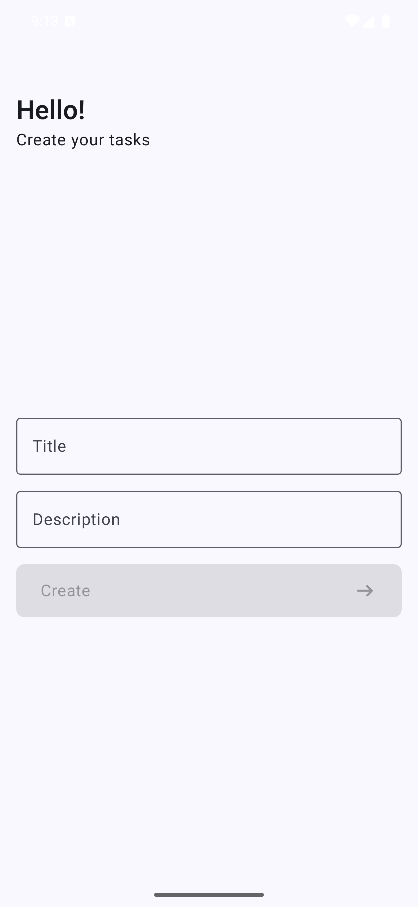
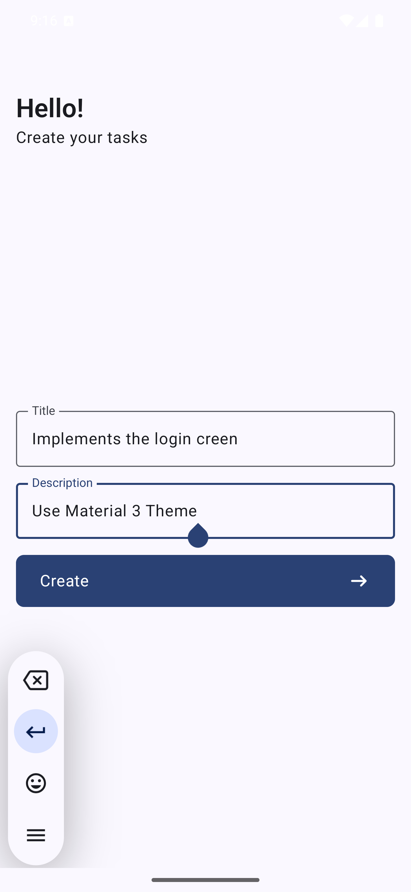
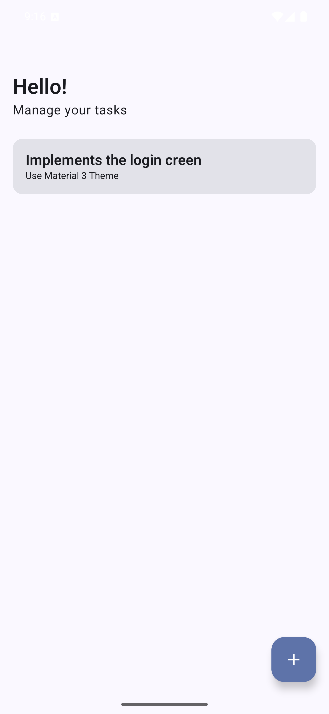

# App Task

The development of the application is intended to practice studies and share knowledge. Application developed in compose

## Features

- `List Tasks`
- `Create Tasks`

## Screens

{width=309 height=679}
{width=309 height=679}
{width=309 height=679}
{width=309 height=679}

## Architecture

* [Room Database](https://developer.android.com/training/data-storage/room)
* Dependency injection with [Hilt](https://developer.android.com/training/dependency-injection/hilt-android)
* [Jetpack ViewModel](https://developer.android.com/topic/libraries/architecture/viewmodel)
* UI using [Jetpack Compose](https://developer.android.com/jetpack/compose) and [Material3](https://developer.android.com/jetpack/androidx/releases/compose-material3)
* [Jetpack Navigation](https://developer.android.com/jetpack/compose/navigation)
* [Reactive data layer](https://developer.android.com/topic/architecture/data-layer)
* [Kotlin Coroutines and Flow](https://developer.android.com/kotlin/coroutines)

## Opening a sample in Android Studio

To open one of the samples in Android Studio, begin by checking out one of the sample branches, and then open the root directory in Android Studio. The following series of steps illustrate how to open the sample.

Clone the repository:

- `git clone https://github.com/douglaswilliamnsantana/task-android.git`

Finally open the task-android/ directory in Android Studio.
